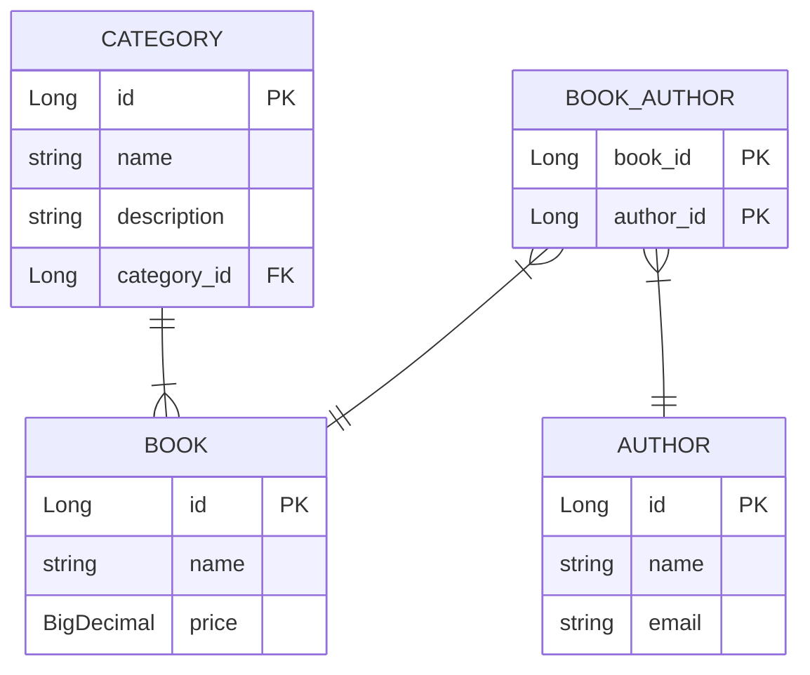

# Library-System-Crud

A Spring-Boot RESTful API for managing books, authors, and categories in a library system with full CRUD functionalities.

**You can check the Postman requests' collection here:**

[](https://app.getpostman.com/run-collection/29664655-3c9d7b36-1419-4146-861f-32c8a74d11b5?action=collection%2Ffork&source=rip_markdown&collection-url=entityId%3D29664655-3c9d7b36-1419-4146-861f-32c8a74d11b5%26entityType%3Dcollection%26workspaceId%3D5c59c674-7712-4a15-b429-da6b703c2752)
> If you couldn't find the collection for any reason, you can import this **[File](./src/main/resources/Library-System.postman_collection.json)** manually to Postman.

**Also, you can try the application out on GitPod, it's a pre-configured online IDE. You can ignore the first 2 steps if you used it**

[](https://gitpod.io/#https://github.com/Zeyad2003/Library-System-Crud)
> You may need this **[link](https://stackoverflow.com/questions/69669688/login-mysql-on-gitpod)** :)

## Installation

To run the library System locally, Make sure you install the following first:
- Java 17
- MySQL

Once you have the required tools installed, follow these steps to install the Bank Management System:

1. Clone this repository:
    ```shell
       git clone https://github.com/Zeyad2003/Library-System-Crud.git
    ```

2. Navigate to the project directory:
    ```shell
    cd Library-System-Crud
    ```

3. Prepare the database schema and credentials:

   ```shell
   mysql -u root < ./src/main/resources/db/prepare.sql
   ```

4. Build and run the application using Maven
    ```shell
    ./mvnw spring-boot:run
    ```

5. Insert sample data into the database for trying out the application:
    ```shell
    mysql -u root < ./src/main/resources/db/insertion.sql
    ```

6. Access the application endpoints at: `http://localhost:8080/`

7. You can explore the API documentation at: `http://localhost:8080/swagger-ui.html`. This provides detailed insights into the available API endpoints and functionalities.
> If you just want to see the API documentation without running the application you can check this **[File](./src/main/resources/End-Points-Docs.md)**

## ERD Code


> [!NOTE]
> The unit tests aren't complete yet, I'm going to complete them soon.
