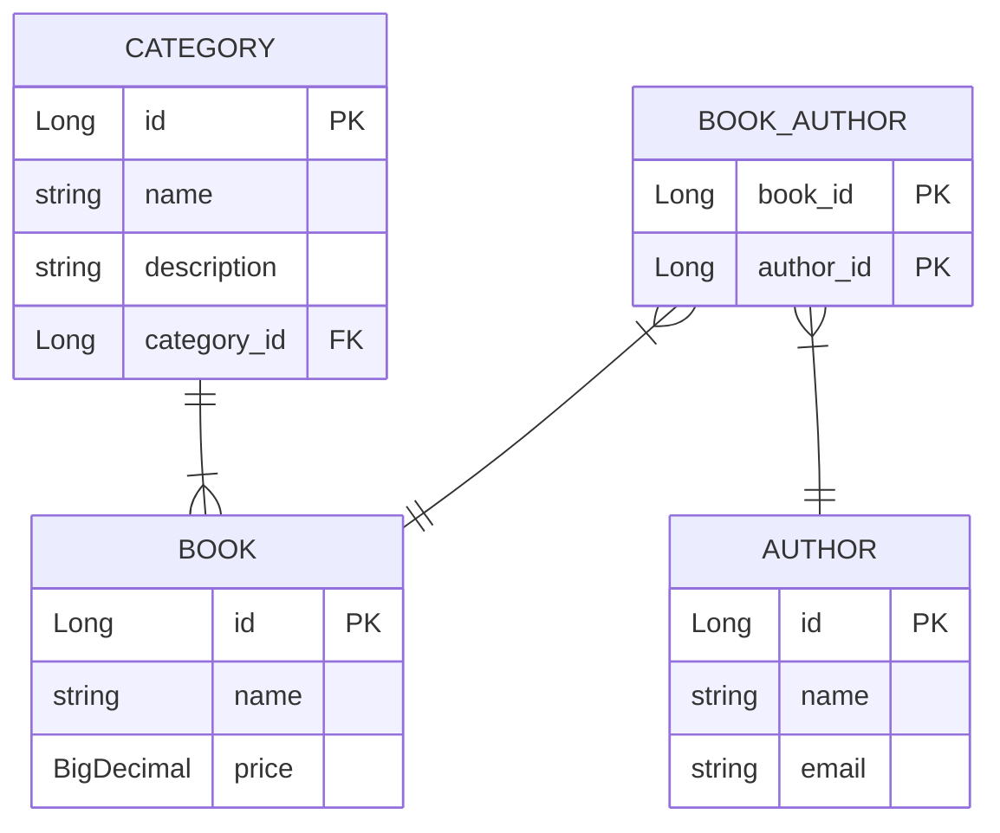

# Library-System-Crud
Library System with Spring Boot and Spring Data JPA

## Requirements
- CRUD application of library system

1. full working APIs to add, update, delete, find by id, search - including a unit testing for repo and service layers
2. Database ERD using https://mermaid.live/
3. Dockerfile
4. Readme.md file that contains some information about the project and embed the ERD in it
5. push to GitHub

## ERD Code
