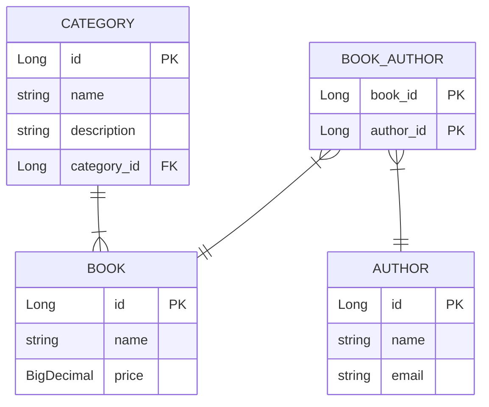

# Library-System

Welcome to the Library-System-Crud project!

## Table of Contents
- **[Brief Introduction](#brief-introduction)**
- **[Features](#features)**
- **[Installation](#installation)**
- **[Postman Requests](#postman-requests)**
- **[Database Schema](#database-schema)**
- **[Used Technologies](#used-technologies)**

## <a name="brief-introduction"></a> Brief Introduction

A Spring-Boot RESTful API for managing books, authors, and categories and the relation between them in a library system with full CRUD functionalities.

## <a name="features"></a> Features

- Full CRUD functionalities for `books`, `authors`, and `categories`.
- Separated layers for `controllers`, `services`, `repositories`, and `models`.
- Documented API using **Swagger**.
- Applied multiple design patterns like **`DTO`**, **`Builder`**, and **`Facade`**.
- Used external libraries like **`MapStruct`** and **`Lombok`** to reduce boilerplate code.
- Utilized **`MySQL`** database to store the data, and managed it using **`Spring Data JPA`** and **`Hibernate`**.
- Used **`Docker`** to containerize the application, and modify **`GitPod`** workspace for running the application.

## <a name="installation"></a> 🚀&nbsp; Installation

### GitPod

<details>

<summary>Install on cloud-based IDE - GitPod</summary>

<br>

[](https://gitpod.io/#https://github.com/Zeyad2003/Library-System-Crud)

1. Open the project in GitPod using the button above.
    - It will take about 2 or 3 minutes to build the workspace.

2. Open the terminal, and download the required tools
    - Maven
       ```shell
       sudo apt install maven -y
       ```
    - Java 17 (Press `y` after complete for using java 17)
       ```shell
       source "$HOME/.sdkman/bin/sdkman-init.sh"
       sdk install java 17.0.10.fx-zulu
       ```

3. Prepare the database with random sample data:
   ```shell
   mysql -u root < ./src/main/resources/prepare.sql
   ```

4. Build and run the application using Maven
   ```shell
    mvn spring-boot:run
    ```

5. Check the ports page and navigate to the link that has the port 8080:

   

</details>

---

### Local Machine

<details>
<summary>Install on your local machine</summary>

First, make sure you install the following tools:

- Java 17
- Maven
- MySQL

Once you have the required tools installed, follow these steps to install the Bank Management System:

1. Clone this repository:
    ```shell
       git clone https://github.com/Zeyad2003/Library-System-Crud.git
    ```

2. Navigate to the project directory:
    ```shell
    cd Library-System-Crud
    ```

3. Prepare the database with random sample data:
   ```shell
   mysql -u root < ./src/main/resources/db/prepare.sql
   ```

4. Build and run the application using Maven
    ```shell
    mvn spring-boot:run
    ```

5. Access the application endpoints via: `http://localhost:8080`

</details>

> [!IMPORTANT]
>
> - on **Local Machine** the url will be like this: `http://localhost:8080/{endpoint}`
> - on **GitPod** As we're using a cloud based IDE the url may be like this:
> - `https://8080-<workspace-id>.ws-eu107.gitpod.io/{endpoint}`
> - `{endpoint}` is the endpoint you want to access.
>
> - For example, here are some endpoints for `GET` requests:
>   - /author
>   - /author/1
>   - /author/1/books
>   - /book
>   - /book/1
>   - /book/1/authors
>   - /category
>   - /category/1
>   - /category/1/books
>   - /swagger-ui.html

If you want to see the API documentation without running the application you can check this **[File](./src/main/resources/End-Points-Docs.md)**

## <a name="postman-requests"></a> Postman Requests

[](https://app.getpostman.com/run-collection/29664655-3c9d7b36-1419-4146-861f-32c8a74d11b5?action=collection%2Ffork&source=rip_markdown&collection-url=entityId%3D29664655-3c9d7b36-1419-4146-861f-32c8a74d11b5%26entityType%3Dcollection%26workspaceId%3D5c59c674-7712-4a15-b429-da6b703c2752)

If you couldn't find the collection for any reason, you can import this **[File](./src/main/resources/Library-System.postman_collection.json)** manually to Postman.

## <a name="database-schema"></a> Database Schema



## <a name="used-technologies"></a> Used Technologies & Tools

- Java 17
- Spring Boot
- Maven
- MySQL
- Spring Data JPA
- Lombok
- MapStruct
- Swagger
- Docker
- GitPod

> [!NOTE]
> The unit tests aren't complete yet, I'm going to complete them soon.
