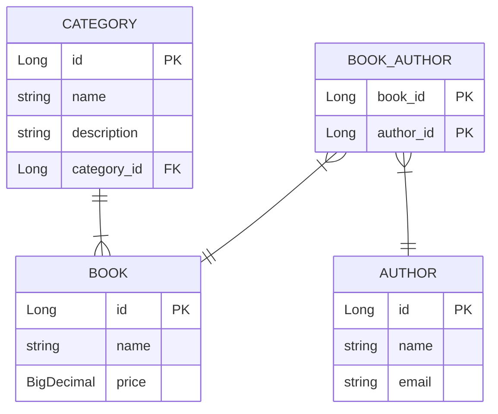

# Library-System-Crud
Library System with Spring Boot and Spring Data JPA

&emsp;

## Description
- Full Library System CRUD application

1. full working APIs to add, update, delete, find by id, search -
2. including a unit testing for repo and service layers
3. Database ERD using https://mermaid.live/
4. Dockerfile
5. Readme.md file that contains some information about the project and embed the ERD in it
6. push to GitHub

## ERD Code

## API Documentation
### Authors
- **`GET /author`**
    - **Description:** Retrieve all authors.

- **`GET /author/{id}`**
    - **Description:** Retrieve an author by ID.

- **`GET /author?name={name}`**
    - **Description:** Retrieve an author by name.

- **`POST /author`**
    - **Description:** Add a new author.

- **`PUT /author/{id}`**
    - **Description:** Update author information.

- **`DELETE /author/{id}`**
    - **Description:** Delete an author.

- **`PUT /author/{id}/restore`**
    - **Description:** Restore a deleted author.

- **`GET /author/{id}/books`**
    - **Description:** View all books associated with a specific author.

- **`POST /author/{id}/book/{id}`**
    - **Description:** Associate an author with a book.

### Books
- **`GET /book`**
    - **Description:** Retrieve all books.

- **`GET /book/{id`}**
    - **Description:** Retrieve a book by ID.

- **`GET /book?name={name}`**
    - **Description:** Retrieve a book by name.

- **`POST /book`**
    - **Description:** Add a new book.

- **`PUT /book/{id}`**
    - **Description:** Update book information.

- **`DELETE /book/{id}`**
    - **Description:** Delete a book.

- **`PUT /book/{id}/restore`**
    - **Description:** Restore a deleted book.

- **`GET /book/{id}/authors`**
    - **Description:** View all authors associated with a specific book.

### Categories
- **`GET /category`**
    - **Description:** Retrieve all categories.

- **`GET /category/{id}`**
    - **Description:** Retrieve a category by ID.

- **`GET /category?name={name}`**
    - **Description:** Retrieve a category by name

- **`POST /category`**
    - **Description:** Add a new category.

- **`PUT /category/{id}`**
    - **Description:** Update category information.

- **`GET /category/{id}/books`**
    - **Description:** View all books associated with a specific category.

---

> [!NOTE]
> The unit tests aren't complete yet, I'm still working on them.
